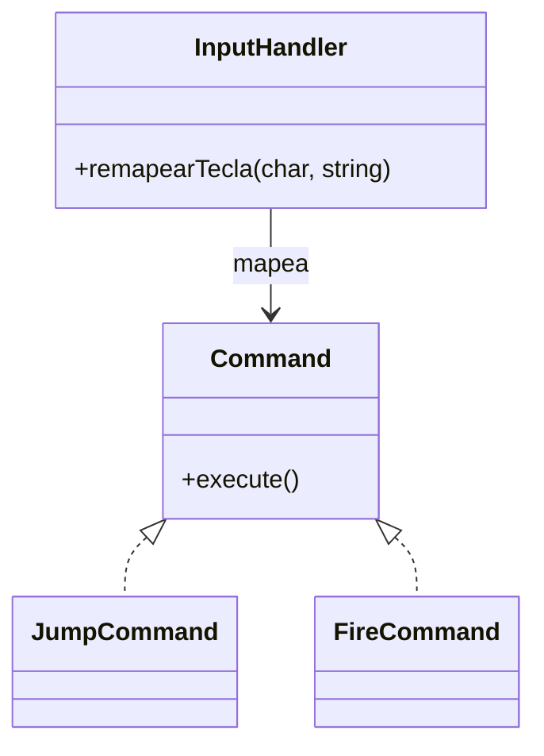
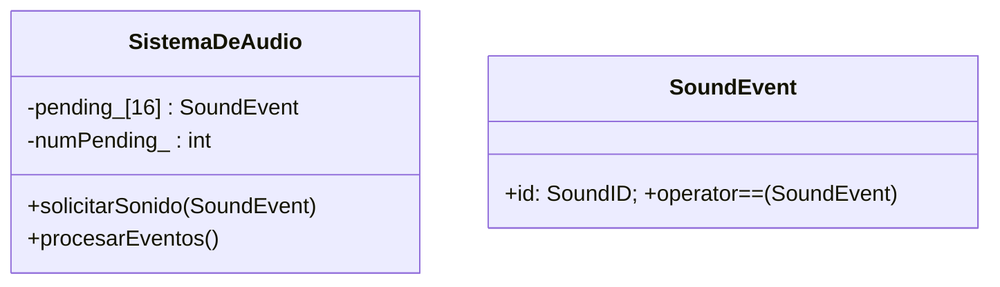

# Portafolio de Patrones en C++ (App de Consola)

Pequeño portafolio implementando patrones: **Command**, **State (FSM)**, **Observer** y **Event Queue con filtrado**. El objetivo es mostrar código limpio, estructurado y documentado, listo para revisión técnica.
Teniendo además una Fuente para consultar estructuras/patrones que pueden ser de utilidad en un futuro.

## Índice
- [Estructura del repositorio](#estructura-del-repositorio)
- [Compilación y ejecución](#compilación-y-ejecución)
- [Patrones](#patrones)
  - [Command](#command)
  - [State (FSM)](#state-fsm)
  - [Observer](#observer)
  - [Event Queue + Filtrado](#event-queue--filtrado)
- [Estilo de código](#estilo-de-código)
- [Versionado](#versionado)

## Compilación y ejecución
1. Clona el repositorio y abre la solución de Visual Studio.
2. En el proyecto, agrega todos los `.cpp` y `.h` desde `Source/` si no se agregan automáticamente.
3. Configura la carpeta `Source/` como Include Directory si fuera necesario.
4. Compila (x64 Debug) y ejecuta.

## Patrones

### Command
**Idea:** mapear entradas a comandos desacoplados del actor.  
**Clases clave:** `Patterns/Command/Command.h`, `Core/InputHandler.h`.  
**Fragmento representativo:**
```cpp
// InputHandler::remapearTecla(char tecla, const std::string& accion)
```
**UML (simplificado):**


### State (FSM)
**Idea:** el comportamiento de `Personaje` depende del estado actual.  
**Clases:** `Core/Personaje.h`.  
**Fragmento:**
```cpp
// Personaje::handleInput, Personaje::update
```
**UML:**
```mermaid
classDiagram
  class Personaje {
    +handleInput(char)
    +update()
    -currentState_: State
  }
  enum State { IDLE, JUMPING, ATTACKING }
```

### Observer
**Idea:** notificar 1-a-muchos sin dependencias directas.  
**Clases:** `Patterns/Observer/IObserver.h`, `Systems/SistemaDeLogros.h`, `Systems/SistemaDeAudio.h`.  
**Fragmento:**
```cpp
// Personaje::agregarObserver, Personaje::notificar, SistemaDeLogros::onNotify
```
**UML:**
```mermaid
classDiagram
  class IObserver { +onNotify(const Personaje&, Evento)* }
  IObserver <|.. SistemaDeAudio
  IObserver <|.. SistemaDeLogros
  Personaje "1" o--> "0..10" IObserver : suscriptores
  enum Evento { PERSONAJE_RECIBE_DANO }
```

### Event Queue + Filtrado
**Idea:** desacople temporal; encolar y procesar por frame con eliminación de duplicados.  
**Clases:** `Patterns/SoundEvent/SoundEvent.h`, `Systems/SistemaDeAudio.h`.  
**Fragmento:**
```cpp
audio.solicitarSonido({SoundID::HIT});
audio.solicitarSonido({SoundID::HIT}); // duplicado
audio.procesarEventos(); // se reproduce una sola vez
```
**UML:**


## Versionado
```bash
git checkout -b feature/professional-portfolio
git commit -am "Refactor: estructura Source/ y documentación Doxygen"
git tag -a v1.0-Command -m "Implementación del Patrón Command"
git tag -a v1.1-State -m "FSM básica en Personaje"
git tag -a v1.2-Observer -m "Observer con arrays fijos"
git tag -a v1.3-EventQueue -m "Cola de audio con filtrado"
git push origin feature/professional-portfolio
git push origin --tags
```
